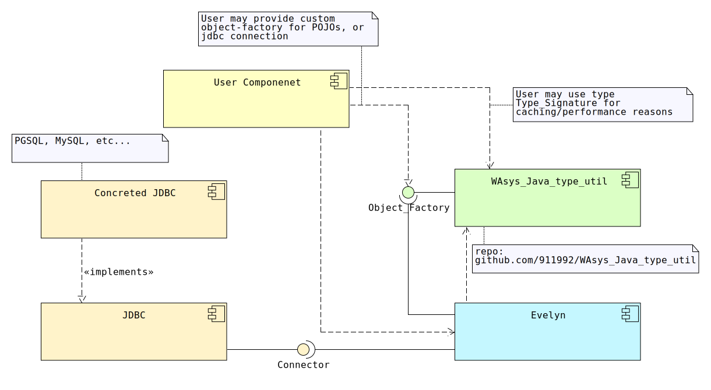
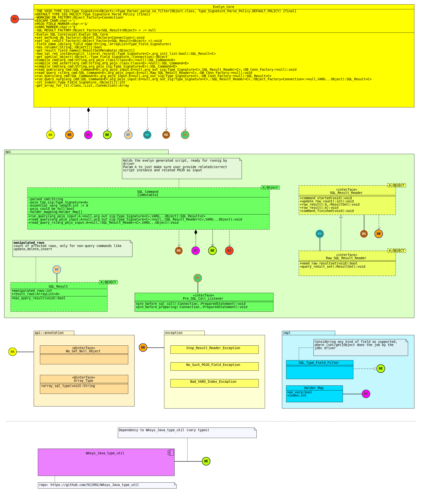

# Evelyn
Evelyn is a cacheless, and lightweight Java ORM library. Evelyn comes without a dedicated query language(like JPQL), so consider queries are provided may not work with all JDBC-connectors/DBs.

Evelyn supports both low-level `ResultSet`, and ORM methods. It depends on [WAsys_Java_type_util](https://github.com/911992/WAsys_Java_type_util) for POJO filling.

## Revision History
Latest: v0.1.0 (Oct 22, 2022)  

Please refer to [release_note.md](./release_note.md) file  

## Requirments
0. Java 1.8  
1. A JDBC `Connector`  
2. [WAsys_Java_type_util](https://github.com/911992/WAsys_Java_type_util)  

## Composition Structure
  
*diagram 1: [Composition structure diagram](./_docs/diagrams/composite_struct_diagram.svg)*

### Explination
**Evelyn** requires a `Connection` provided by either user, or underlying context, tho calls like processing a sql query/command may be placed even before `Connection` is set. **User Component** *may*(recommented) caches related types are required by **Evelyn** for performane related.

**WAsys_Java_type_util** : This componenet/repo is used for **Evelyn** to parse requried POJO classes for both inputs(as arg) and outputs(as ORM). **User Componenet** may keep(cache) related objects for performance matters(recommended)

**JDBC** : **Evelyn** requires a `Connection`(factory) which should be provided by the user. Unlike JPA(or simmilar ORM), there **is no** Evelyn-level query language(like JPQL for JPA), so mind the queries are either based on STD-SQL, or compatible with **Concreted JDBC**.


## Supported Types
Almost any type(except multi-level POJO filling). It includes all dedicated SQL types(like `Timestamp` ...), primitives, dedicated concreted-JDBC's types, and Arrays (SQL `Array` as `List`). Mind using wrapper classes when `null` possible instead of primitives(like `Long` instead of `long`).

## Initializing Evelyn(Connection Factory)
As stated, a concreted SQL/JDBC `Connection` must be given to Evelyn, before calling any "query run" call, while compiling commands are possible.

User must implement and instance `Object_Factory<Connection>` and pass it to the `Evelyn_Core.set_working_db_factory(:Object_Factory<Connection>):void`. COnsidering following example:

```java
//------------------
//NOTE: not recommended way, considering connection-pooling
//implementing an Object_Factory (user , only once probably)
static final Object_Factory<Connection> DB_FACTORY = new Object_Factory<Connection>() {
  @Override
  public Connection create_object(Class arg_type) {
    //let it be pgsql(or whatever)
    Driver _d = new org.postgresql.Driver();
    Properties _ps = new Properties();
    _ps.put("user", "911992");
    _ps.put("password", "very strong passwd");
    try {
      return _d.connect("jdbc:postgresql://homesweethome:666/my_db", _ps);
    } catch (Exception e) {
      e.printStackTrace();
      return null;
    }
  }
};
//------------------
//giving the connection-factory to Evelyn
Evelyn_Core.set_working_db_factory(DB_FACTORY);
```

In managed env(like web-context), the `set_working_db_factory()` is probably called once during app initialization(or later when required/lazy-loading). 

## POJO Filling Mode
Evelyn uses [**WAsys_Java_type_util**](https://github.com/911992/WAsys_Java_type_util) for both filling(output) and arg(reading/input) POJOs.  

Please note only one-to-one mapped fields/columns are used for filling the POJO. It means if resultset comes with a column that has no related mapping to the POJO, then it will be ignored, and viceversa.

**IMPORTANT NOTE:** Mind Evelyn treats each specified field as a possible assignable object from related SQL result. It means if the top POJO object has a POJO field, then Evelyn **won't** fall into that object/POJO to fill its fields. Fillig happens only one level, and it's top-level.

## Query Command Processing
Evelyn **only** validates placeholders, and leave the rest, to be validated by the concreted JDBC driver. It means there is no any strict query language defines(like JPQL, etc).

### Placeholders
There are two kind of placeholders. Both placeholders will be replaced with JDBC-std `?` placeholder/char, to make the script meaningful for the JDBC api later when a query call is placed.

* **`&field_name&`**: where `field_name` refers to the field name of the POJO. Like `&dev&`
* **`$0$`**: where `0` refers to argument index of given varg. Like `$0$`. **Must be** started from 0. (order doesn't matter tho)

Mind field-palceholders like `&space&` are referes to input(arg) POJOs. Escaping can be done using `\`, like `\$0\$` will be replaced with `$0$` in target sql command.

Example: `select $0$ + $1$ where &gang& is not null` . This command will be compiled as `select ? + ? where ? is not null`, and related sql placeholders(`?`) will be set based on given content later.

Please mind, an Evelyn-level placeholder could be duplicated. Also mind the order of indexed args are not important. Considering following exmaple.

Example: `select &dev& || $2$ where $0$ > $1$ and $2$ is not null` . Compiled command will be like `select ? || ? where ? > ? and ? is not null`. Evelyn will set placeholders proper based on appearance, like `?` at `1` and, `4` indeces will be set based on `2`(`$2$`) varg input

**Important Note:** SQL level `?` placeholders are not allowed. A command like `select $0$ where id > ?` will break things up.

## Compiling A Command
The `SQL_Command` type in Evelyn acts just like what `PreparedStatement` does for JDBC(but not exactly). SQL queries are compiled by either `Evelyn_Core.compile_cmd()`, or `Evelyn.compile_cmd_assert()` methods. Both methods come with following signature:

```
compile_cmd(arg_cmd:String,arg_pojo_class:Class<E>:=null):SQL_Command<E>
```

In above code, `arg_cmd` refers to the sql command needs to be parsed, and `arg_pojo_class`(which can be `null`/ignored) refers to the *input*(arg) POJO's (for fulfilling the `&AAA&` placeholders) type signature.

The `arg_pojo_class` could be `null`, when there is no any fullfil by an input POJO requried(like a command like `select current_timestamp`)

**Example**

```java
//------------------
//input POJO class
class Arg_Clazz{
  String n_str;
  long ld_age;
  //when getter funcs are avaialble, then they are called for grabbing the value, otehrwsie, directly by field accessing.
}
//------------------
//the Evelyn-ready command (happens once)
static final String EVELYN_SQL_CMD_SCR = "select * from cool_table where rec_sig = &n_str& and id = &ld_age& limit 10 offset $0$";
//asking for compile the command (happens once)
static final SQL_Command EVELYN_SQL_CMD = Evelyn_Core.compile_cmd(EVELYN_SQL_CMD_SCR,Arg_Clazz.class);
//------------------
//Evelyn db factory settign (happens once)
//please see "Initializing Evelyn(Connection Factory)" section above
Evelyn_Core.set_working_db_factory(DB_FACTORY);
//------------------
//sample call and processing results (continue reading...)
```

**More SQL Command Examples**  
As stated, Evelyn just finds and replaces placeholders with JDBC `?` placeholders(with some metainfo about placholders positions/indices). So it cannot tell if the given SQL command is logical, regardless of placeholders. Considering follwoing examples:

```java
//hard-coded array example (PGSQL)
String SQL_CMD_SRT = "select array[$0$,$1$,$1$]::int[]"; //select array[?,?,?]::int[]
//hardcoded type-cast at SQL-level (PGSQL)
String SQL_CMD_SRT = "select &dev&::bigint"; //select ?::bigint
//array type (PGSQL), related "arr_field" MUST be an @Array_Type annotated List object
String SQL_CMD_SRT = "select &arr_field&"; //will be like select ?::bigint[]
```

### Array Types
Array types are supported for both input POJO placeholders, and outut POJOs. For input POJOs related field **MUST BE** annotated by an `@Array_Type` annotation. Evelyn will asks working `Connection` object to create a SQL `Array` object based on type specified, and then set the array object to related placeholder index. Consider following example

```java
//input/arg POJO
class Blocks{
  //telling Evelyn, to treat block_ids as ::bigint[]
  @Array_Type(array_sql_type = "bigint")
  ArrayList<long> block_ids;
  //::text[]
  @Array_Type(array_sql_type = "text")
  ArrayList<String> hashes;
}
//------------------
//the Evelyn-ready command (happens once)
static final String EVELYN_SQL_CMD_SCR = "insert into cool_schema.blocks values(&block_ids&,&hashes&);";
//------------------
//compile, and use it...
```

For output POJOs, Evelyn will extract every element from SQL-`Array`, and append/add each item to target output POJO's `List` field. No any annotation is needed, but user should use a proper(convertable) boxing-type for related `List`, like `List<String>` for a `text[]`, or `ArraList<Long>` for a `int[]` type.

## Preparing JDBC(`PreparedStatement`)
Evelyn calls generic `PreparedStatement.setObject()` instead of type-specific functions(like `setLong()`,...) for preparing/setting placeholders(`?`).

## Handling Results
Once a result(`ResultSet`) of a query call is ready, Evelyn either fill up related POJOs(output/result), or pass the whole `ResultSet` to the user if asked. For data manipulation commands(like `insert`, `update`,...) that advances only one int value as affected rows, the related value is given to the user if applicable.

`SQL_Command` type comes with 3 functions listed below about placing a request.

```
+run_query(arg_pojo_input:A:=null,arg_out_sig:Type_Signature<C>,VARG...Object):SQL_Result<C>
+read_query(arg_pojo_input:A=null,arg_out_sig:Type_Signature<C>:=null,:SQL_Result_Reader<C>,VARG...Object):void
+read_query_rs(arg_pojo_input:A=null,:SQL_Result_Reader<C>,VARG...Object):void
```  

**Where**  
* **`arg_pojo_input`** the input argument (POJO to placeholders) if requried. If `SQL_Command` has any `&AAA&` placeholder(map from POJO), then this MUST NOT BE `null`, otherwise, could be.
* **`VARG...Object`** referes to the `$N$` indexed placeholders of related `SQL_Command`, the first object is set for `$0$` placeholder(s), and so on.
* **`run_query()`** will creates a `SQL_Result` as result. Mind the `arg_out_sig` MUST NOT be `null` if related sql query command may advances some records, otherwise could be null for record-effective results.
* **`read_query()`** almost as same as `run_query()`, instead, arg `SQL_Result_Reader` could be given for stream/event-like POJO filling, or asking for raw `ResultSet` (please continue reading ahead for more detailed info)
* **`read_query_rs()`** is just like `read_query()` for raw `ResultSet` mode only. Note give `SQL_Result_Reader` reader must be a `Raw_SQL_Result_Reader`


### Getting Results Using A `SQL_Result`
`run_query()` function asks to read the whole `ResultSet`, by mapping all records into related/target POJO's instances, and return the result using an instance of `SQL_Result`.

User needs to specify `Type_Signature` of target POJO if the related sql query advances any result(record), but if the query is a record-effective, then no need for this object.

`Type_Signature` of target POJO could be created using `Type_Parser.parse_no_filter()`.  
Considering following example 

```java
//------------------
//result pojo
class Log_Entity{
  Timestamp ts;
  String serial;
  int flags;
}
//------------------
//result pojo's type-signature (happens once)
static final Type_Signature<Log_Entity> Log_Entity_TYP_SIG = Type_Parser.parse_no_filter(Log_Entity.class, Evelyn_Core.DEFAULT_TYPE_SIG_POLICY);
//------------------
//sql - command compiling
static final SQL_Command EVELYN_SQL_CMD = Evelyn_Core.compile_cmd_assert("select event_date as ts,hash as serial,flags::int from public.sys_log limit 7 offset $0$");
//------------------
//call for the result
SQL_Result<Log_Entity> call_resp =  EVELYN_SQL_CMD.run_query(null/*no input POJO*/,Log_Entity_TYP_SIG,13 /*as $0$*/);
//using call_resp ...
```

In above code, arg-value `13` is part of `VARG`, and as it's the first element, it will be used to be placed for all `$0$` placeholders. Mind the first `null` arg to `run_query()` function is becasue there is no any POJO level placeholders(like `&field&`).

**Note:** default `Object_Factory` instance of `Log_Entity_TYP_SIG`(`Type_Signature`) can be set by user if requried.

### Stream(Event) Based Result Handling Using `SQL_Result_Reader`
Evelyn would ignore creating a `SQL_Result` to put whole result into and return, and instead calls related callbacks(funcs) of given `SQL_Result_Reader` (or `Raw_SQL_Result_Reader`). Mind if a `SQL_Result_Reader` is provided, then no `SQL_Result` will be generated.

One benefit of using `SQL_Result_Reader` is when reading rest of a `ResultSet` should be ignored, by throwing a simple `Stop_Result_Reader_Exception` exception.

Type `Raw_SQL_Result_Reader` is useful when POJO filling should be ignored by the Evelyn, and instead user may take care about manipulating content of the `ResultSet`. Note that `Raw_SQL_Result_Reader` is a child type of `SQL_Result_Reader`.

Considering following examples

```java
//------------------
//result pojo
class Data_Entity{
  long id;
  String hash;
}
//------------------
//result pojo's type-signature (happens once)
static final Type_Signature<Data_Entity> Data_Entity_TYP_SIG = Type_Parser.parse_no_filter(Data_Entity.class, Evelyn_Core.DEFAULT_TYPE_SIG_POLICY);
//------------------
//sql - command compiling
static final SQL_Command EVELYN_SQL_CMD = Evelyn_Core.compile_cmd_assert("select id,hash from block_info limit $0$ offset $1$");
//------------------
//reader
class Data_Entity_Reader implements SQL_Result_Reader<Data_Entity>{
  @Override
  public void row_result(Data_Entity arg_ins)throws Stop_Result_Reader_Exception,SQLException{
    //using arg_ins ...
    //need to stop processing further records? so throw a Stop_Result_Reader_Exception (or SQL_Result_Reader.DEFAULT_STOP_QUERY_READING_EX_INSTANCE)
    //throw SQL_Result_Reader.DEFAULT_STOP_QUERY_READING_EX_INSTANCE;
  }
}
//reader instance (maybe only one(singleton), or many)
Data_Entity_Reader pojo_result_reader = new Data_Entity_Reader();
//------------------
//call 
EVELYN_SQL_CMD.read_query(null/*input POJO*/,Data_Entity_TYP_SIG,pojo_result_reader,/*indexed placeholders->*/ 7 /*0*/, 0 /*1*/);
```

`Raw_SQL_Result_Reader` Example:  

```java
//------------------
//sql - command compiling
static final SQL_Command EVELYN_SQL_CMD = Evelyn_Core.compile_cmd_assert("select * from block_info limit $0$ offset $1$");
//------------------
//reader
class Raw_Data_Reader implements Raw_SQL_Result_Reader{
  @Override
  public void query_result_set(ResultSet arg_rs)throws SQLException{
    //using arg_rs ...
    //may, or maynot close the ResultSet
  }
}
//reader instance (maybe only one(singleton), or many)
Raw_Data_Reader raw_result_reader = new Raw_Data_Reader();
//------------------
//call 
read_query_rs(arg_pojo_input:A=null,:SQL_Result_Reader<C>,VARG...Object):void
EVELYN_SQL_CMD.read_query_rs(null/*input POJO*/,raw_result_reader,/*indexed placeholders->*/ 7 /*0*/,0 /*1*/);
```

## `SQLException`
Probably, none of thrown `SQLException`s are related to Evelyn itself, rather it related to sql command which is not sensible for target JDBC driver

## No Managed Transactions
Transactions are not supported, tho user is able to have a transactional calls manually, by controlling `Connection` creations. Mind beginning, commiting, save-points, and rollbacks must be done by the user manually.

## Class Diagram
  
*diagram 2: [Class diagram](./_docs/diagrams/class_diagram.svg)*